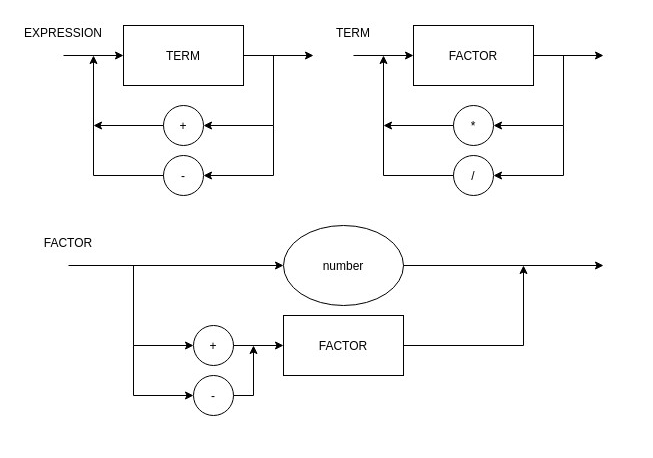

EBNF: 
EXPRESSION = TERM, { ("+" | "-"), TERM } ;
TERM = FACTOR, { ("*" | "/"), FACTOR } ;
FACTOR = ("+" | "-") FACTOR | "(" EXPRESSION ")" | number ;

Obs: Since we consider every number a integer, we can abstract NUMER as:
NUMBER = DIGIT, {DIGIT} ;
DIGIT = 0 | 1 | ... | 9 ;

